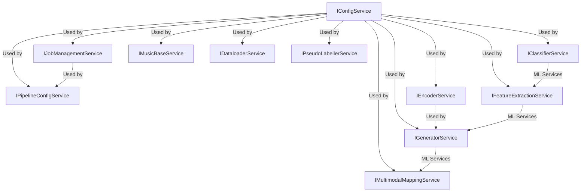

# Service Interface Documentation

## Overview

This document provides comprehensive documentation for all service interfaces in the PA-AI-2 generative module. The interfaces are designed following the dependency injection pattern and provide clean abstractions for all major system components.

## Table of Contents

1. [Core Services](#core-services)
2. [ML/AI Services](#mlai-services)
3. [Utility Services](#utility-services)
4. [Usage Examples](#usage-examples)
5. [Best Practices](#best-practices)

---

## Core Services

### IConfigService

**Purpose**: Provides configuration management and validation services.

**Interface**: `domain.interfaces.service_interfaces.IConfigService`

**Methods**:
- `load_config(config_path: str, validate: bool = True) -> Dict[str, Any]`
  - Loads configuration from YAML file
  - Validates configuration if requested
  - Returns configuration dictionary

- `get_service_config(service_name: str, config_path: Optional[str] = None) -> Dict[str, Any]`
  - Retrieves service-specific configuration
  - Supports configuration inheritance
  - Returns service configuration dictionary

**Implementation**: `ConfigServiceAdapter`

**Dependencies**: None

**Usage**:
```python
from domain.interfaces import IConfigService
from domain.interfaces.dependency_injection import get_dependency_container

container = get_dependency_container()
config_service = container.resolve(IConfigService)

# Load main configuration
config = config_service.load_config("shared/config/config.yaml")

# Get service-specific configuration
classifier_config = config_service.get_service_config("classifier")
```

---

### IJobManagementService

**Purpose**: Manages background job execution and monitoring.

**Interface**: `domain.interfaces.service_interfaces.IJobManagementService`

**Methods**:
- `create_job(job_type: str, parameters: Dict[str, Any], priority: JobPriority = JobPriority.NORMAL) -> str`
  - Creates a new background job
  - Returns job ID for tracking

- `get_job_status(job_id: str) -> JobStatus`
  - Retrieves current job status
  - Returns status enum value

- `get_job_result(job_id: str) -> Optional[Dict[str, Any]]`
  - Gets job execution results
  - Returns result dictionary or None

- `cancel_job(job_id: str) -> bool`
  - Cancels a running job
  - Returns success status

- `list_jobs(status: Optional[JobStatus] = None) -> List[Dict[str, Any]]`
  - Lists jobs with optional status filter
  - Returns job information list

**Implementation**: `JobManagementServiceAdapter`

**Dependencies**: `IConfigService`

**Usage**:
```python
from domain.interfaces import IJobManagementService
from domain.models.job_management import JobPriority

job_service = container.resolve(IJobManagementService)

# Create a training job
job_id = job_service.create_job(
    job_type="training",
    parameters={"model": "classifier", "dataset": "EMOPIA"},
    priority=JobPriority.HIGH
)

# Monitor job status
status = job_service.get_job_status(job_id)
```

---

### IPipelineConfigService

**Purpose**: Manages pipeline configuration and orchestration.

**Interface**: `domain.interfaces.service_interfaces.IPipelineConfigService`

**Methods**:
- `create_pipeline_config(config_data: Dict[str, Any]) -> Dict[str, Any]`
  - Creates standardized pipeline configuration
  - Validates configuration structure
  - Returns validated configuration

- `get_pipeline_config(pipeline_name: str) -> Optional[Dict[str, Any]]`
  - Retrieves saved pipeline configuration
  - Returns configuration dictionary or None

- `validate_pipeline_config(config: Dict[str, Any]) -> bool`
  - Validates pipeline configuration structure
  - Returns validation result

- `execute_pipeline(config: Dict[str, Any]) -> str`
  - Executes pipeline with given configuration
  - Returns execution job ID

**Implementation**: `PipelineConfigServiceAdapter`

**Dependencies**: `IConfigService`

**Usage**:
```python
from domain.interfaces import IPipelineConfigService

pipeline_service = container.resolve(IPipelineConfigService)

# Create pipeline configuration
config = {
    "name": "mood_classification_pipeline",
    "steps": ["data_loading", "preprocessing", "training", "evaluation"],
    "parameters": {"dataset": "EMOPIA", "model_type": "classifier"}
}

pipeline_config = pipeline_service.create_pipeline_config(config)
job_id = pipeline_service.execute_pipeline(pipeline_config)
```

---

## ML/AI Services

### IClassifierService

**Purpose**: Provides MIDI mood classification capabilities.

**Interface**: `domain.interfaces.service_interfaces.IClassifierService`

**Methods**:
- `train_model(parameters: Dict[str, Any]) -> Dict[str, Any]`
  - Trains a new classification model
  - Returns training results and metrics

- `classify_midi(midi_data: Any, model_path: Optional[str] = None) -> Dict[str, Any]`
  - Classifies MIDI data for mood
  - Returns classification probabilities

- `evaluate_model(model_path: str, test_data: Any) -> Dict[str, Any]`
  - Evaluates model performance
  - Returns evaluation metrics

- `load_model(model_path: str) -> bool`
  - Loads trained model from file
  - Returns success status

**Implementation**: `ClassifierServiceAdapter`

**Dependencies**: `IConfigService`

**Usage**:
```python
from domain.interfaces import IClassifierService

classifier_service = container.resolve(IClassifierService)

# Train a new model
training_params = {
    "dataset": "EMOPIA",
    "model_type": "transformer",
    "epochs": 50,
    "batch_size": 32
}

results = classifier_service.train_model(training_params)

# Classify MIDI data
classification = classifier_service.classify_midi(midi_data)
print(f"Predicted mood: {classification['predicted_mood']}")
```

---

### IEncoderService

**Purpose**: Encodes and decodes musical data between different representations.

**Interface**: `domain.interfaces.service_interfaces.IEncoderService`

**Methods**:
- `encode_midi(midi_data: Any, encoding_type: str = "remi") -> List[int]`
  - Encodes MIDI data to token sequence
  - Supports multiple encoding formats

- `decode_tokens(tokens: List[int], encoding_type: str = "remi") -> Any`
  - Decodes token sequence back to MIDI
  - Returns MIDI data structure

- `load_vocab(vocab_path: str) -> bool`
  - Loads vocabulary for encoding/decoding
  - Returns success status

- `get_vocab_size() -> int`
  - Returns vocabulary size
  - Used for model configuration

**Implementation**: `EncoderServiceAdapter`

**Dependencies**: `IConfigService`

**Usage**:
```python
from domain.interfaces import IEncoderService

encoder_service = container.resolve(IEncoderService)

# Load vocabulary
encoder_service.load_vocab("shared/conf/ReMIDICaps/midi/remi.yaml")

# Encode MIDI to tokens
tokens = encoder_service.encode_midi(midi_data, "remi")

# Decode tokens back to MIDI
decoded_midi = encoder_service.decode_tokens(tokens, "remi")
```

---

### IFeatureExtractionService

**Purpose**: Extracts features from musical data for ML processing.

**Interface**: `domain.interfaces.service_interfaces.IFeatureExtractionService`

**Methods**:
- `extract_symbolic_features(data: Any) -> Dict[str, Any]`
  - Extracts symbolic music features
  - Returns feature dictionary

- `extract_latent_features(data: Any, model_path: str) -> np.ndarray`
  - Extracts latent features using trained model
  - Returns feature vector

- `initialize_vae_model(config: Dict[str, Any]) -> bool`
  - Initializes VAE model for feature extraction
  - Returns initialization status

- `extract_all_features(data: Any) -> Dict[str, Any]`
  - Extracts all available features
  - Returns comprehensive feature set

**Implementation**: `FeatureExtractionServiceAdapter`

**Dependencies**: `IConfigService`

**Usage**:
```python
from domain.interfaces import IFeatureExtractionService

feature_service = container.resolve(IFeatureExtractionService)

# Initialize VAE model
vae_config = {"model_path": "models/vae.ckpt", "latent_dim": 512}
feature_service.initialize_vae_model(vae_config)

# Extract features
symbolic_features = feature_service.extract_symbolic_features(midi_data)
latent_features = feature_service.extract_latent_features(midi_data, "models/vae.ckpt")
```

---

### IGeneratorService

**Purpose**: Generates musical content using trained models.

**Interface**: `domain.interfaces.service_interfaces.IGeneratorService`

**Methods**:
- `generate_music(parameters: Dict[str, Any]) -> Any`
  - Generates musical content
  - Returns generated MIDI data

- `initialize_model(config: Dict[str, Any]) -> bool`
  - Initializes generation model
  - Returns initialization status

- `set_generation_parameters(parameters: Dict[str, Any]) -> bool`
  - Sets generation parameters
  - Returns success status

- `generate_with_conditioning(conditioning_data: Any, parameters: Dict[str, Any]) -> Any`
  - Generates music with conditioning
  - Returns conditioned generated music

**Implementation**: `GeneratorServiceAdapter`

**Dependencies**: `IConfigService`, `IEncoderService`

**Usage**:
```python
from domain.interfaces import IGeneratorService

generator_service = container.resolve(IGeneratorService)

# Initialize generator model
model_config = {
    "model_path": "models/generator.ckpt",
    "vocab_size": 1382,
    "max_length": 512
}

generator_service.initialize_model(model_config)

# Generate music
generation_params = {
    "length": 256,
    "temperature": 0.8,
    "top_k": 40
}

generated_music = generator_service.generate_music(generation_params)
```

---

### IMultimodalMappingService

**Purpose**: Maps between different modalities (audio, text, image).

**Interface**: `domain.interfaces.service_interfaces.IMultimodalMappingService`

**Methods**:
- `map_text_to_music(text: str, parameters: Dict[str, Any]) -> Any`
  - Maps text descriptions to musical features
  - Returns music representation

- `map_image_to_music(image_data: Any, parameters: Dict[str, Any]) -> Any`
  - Maps image data to musical features
  - Returns music representation

- `initialize_model(config: Dict[str, Any]) -> bool`
  - Initializes multimodal mapping model
  - Returns initialization status

- `encode_modality(data: Any, modality: str) -> np.ndarray`
  - Encodes data from specific modality
  - Returns encoded representation

**Implementation**: `MultimodalMappingServiceAdapter`

**Dependencies**: `IConfigService`

**Usage**:
```python
from domain.interfaces import IMultimodalMappingService

multimodal_service = container.resolve(IMultimodalMappingService)

# Initialize model
model_config = {
    "text_encoder": "clip",
    "image_encoder": "resnet",
    "embedding_dim": 512
}

multimodal_service.initialize_model(model_config)

# Map text to music
text_params = {"style": "classical", "mood": "happy"}
music_features = multimodal_service.map_text_to_music(
    "A happy classical piece", 
    text_params
)
```

---

## Utility Services

### IMusicBaseService

**Purpose**: Provides basic music processing and analysis utilities.

**Interface**: `domain.interfaces.service_interfaces.IMusicBaseService`

**Methods**:
- `extract_chord_progression(midi_data: Any) -> List[str]`
  - Extracts chord progression from MIDI
  - Returns chord symbol list

- `analyze_rhythm(midi_data: Any) -> Dict[str, Any]`
  - Analyzes rhythmic patterns
  - Returns rhythm analysis

- `transpose_midi(midi_data: Any, semitones: int) -> Any`
  - Transposes MIDI data
  - Returns transposed MIDI

- `get_midi_statistics(midi_data: Any) -> Dict[str, Any]`
  - Computes basic MIDI statistics
  - Returns statistics dictionary

**Implementation**: `MusicBaseServiceAdapter`

**Dependencies**: `IConfigService`

**Usage**:
```python
from domain.interfaces import IMusicBaseService

music_service = container.resolve(IMusicBaseService)

# Extract chord progression
chords = music_service.extract_chord_progression(midi_data)
print(f"Chord progression: {chords}")

# Analyze rhythm
rhythm_analysis = music_service.analyze_rhythm(midi_data)
print(f"Tempo: {rhythm_analysis['tempo']} BPM")
```

---

### IDataloaderService

**Purpose**: Manages data loading and preprocessing for ML workflows.

**Interface**: `domain.interfaces.service_interfaces.IDataloaderService`

**Methods**:
- `create_dataloader(config: Dict[str, Any]) -> Any`
  - Creates data loader instance
  - Returns configured data loader

- `load_dataset(dataset_name: str, split: str = "train") -> Any`
  - Loads specified dataset
  - Returns dataset object

- `preprocess_data(data: Any, preprocessing_config: Dict[str, Any]) -> Any`
  - Preprocesses data according to config
  - Returns preprocessed data

- `get_data_statistics(dataset: Any) -> Dict[str, Any]`
  - Computes dataset statistics
  - Returns statistics dictionary

**Implementation**: `DataloaderServiceAdapter`

**Dependencies**: `IConfigService`

**Usage**:
```python
from domain.interfaces import IDataloaderService

dataloader_service = container.resolve(IDataloaderService)

# Create data loader
loader_config = {
    "dataset": "EMOPIA",
    "batch_size": 32,
    "shuffle": True,
    "num_workers": 4
}

dataloader = dataloader_service.create_dataloader(loader_config)

# Load dataset
train_dataset = dataloader_service.load_dataset("EMOPIA", "train")
```

---

### IPseudoLabellerService

**Purpose**: Provides pseudo-labeling capabilities for semi-supervised learning.

**Interface**: `domain.interfaces.service_interfaces.IPseudoLabellerService`

**Methods**:
- `generate_pseudo_labels(data: Any, model_path: str, confidence_threshold: float = 0.9) -> Dict[str, Any]`
  - Generates pseudo labels for unlabeled data
  - Returns pseudo-labeled data

- `initialize_model(config: Dict[str, Any]) -> bool`
  - Initializes pseudo-labeling model
  - Returns initialization status

- `filter_by_confidence(pseudo_labels: Dict[str, Any], threshold: float) -> Dict[str, Any]`
  - Filters pseudo labels by confidence
  - Returns filtered labels

- `evaluate_pseudo_labels(pseudo_labels: Dict[str, Any], ground_truth: Dict[str, Any]) -> Dict[str, Any]`
  - Evaluates pseudo label quality
  - Returns evaluation metrics

**Implementation**: `PseudoLabellerServiceAdapter`

**Dependencies**: `IConfigService`

**Usage**:
```python
from domain.interfaces import IPseudoLabellerService

pseudo_labeller = container.resolve(IPseudoLabellerService)

# Initialize model
model_config = {
    "model_path": "models/classifier.ckpt",
    "threshold": 0.9
}

pseudo_labeller.initialize_model(model_config)

# Generate pseudo labels
pseudo_labels = pseudo_labeller.generate_pseudo_labels(
    unlabeled_data, 
    "models/classifier.ckpt",
    confidence_threshold=0.8
)
```

---

## Usage Examples

### Complete Pipeline Example

```python
from domain.interfaces import *
from domain.interfaces.dependency_injection import get_dependency_container

# Initialize dependency container
container = get_dependency_container()

# Resolve services
config_service = container.resolve(IConfigService)
classifier_service = container.resolve(IClassifierService)
encoder_service = container.resolve(IEncoderService)
dataloader_service = container.resolve(IDataloaderService)

# Complete ML pipeline
def run_classification_pipeline():
    # 1. Load configuration
    config = config_service.load_config("shared/config/unified_config.yaml")
    
    # 2. Create data loader
    loader_config = config["services"]["dataloader"]
    dataloader = dataloader_service.create_dataloader(loader_config)
    
    # 3. Load vocabulary
    vocab_path = "shared/conf/ReMIDICaps/midi/remi.yaml"
    encoder_service.load_vocab(vocab_path)
    
    # 4. Train classifier
    training_params = config["services"]["classifier"]["training"]
    results = classifier_service.train_model(training_params)
    
    # 5. Evaluate model
    evaluation_results = classifier_service.evaluate_model(
        results["model_path"],
        dataloader
    )
    
    return evaluation_results

# Run pipeline
results = run_classification_pipeline()
print(f"Classification accuracy: {results['accuracy']:.3f}")
```

### Service Discovery Example

```python
from domain.interfaces.service_registry import get_enhanced_service_registry

# Get service registry
registry = get_enhanced_service_registry()

# Discover services by criteria
ml_services = registry.discover_services(tag="ml")
healthy_services = registry.discover_services(healthy_only=True)

# Get service information
for service in ml_services:
    info = registry.get_service_info(service.service_name)
    print(f"Service: {info['name']}")
    print(f"  Status: {info['status']}")
    print(f"  Success Rate: {info['metrics']['success_rate']:.2%}")
```

---

## Best Practices

### 1. Service Resolution

Always resolve services through the dependency injection container:

```python
# ✅ Good
container = get_dependency_container()
service = container.resolve(IServiceInterface)

# ❌ Bad - Direct instantiation
service = ConcreteService()
```

### 2. Error Handling

Implement proper error handling for service operations:

```python
try:
    result = service.process_data(data)
except ServiceException as e:
    logger.error(f"Service error: {e}")
    # Handle gracefully
except Exception as e:
    logger.error(f"Unexpected error: {e}")
    # Handle unexpected errors
```

### 3. Configuration Management

Use the configuration service for all configuration needs:

```python
# ✅ Good
config_service = container.resolve(IConfigService)
config = config_service.get_service_config("my_service")

# ❌ Bad - Direct file access
with open("config.yaml") as f:
    config = yaml.load(f)
```

### 4. Resource Management

Properly manage resources and cleanup:

```python
# ✅ Good
try:
    service.initialize_model(config)
    result = service.process_data(data)
finally:
    service.cleanup()
```

### 5. Testing

Use mock services for testing:

```python
from unittest.mock import Mock

# Create mock service
mock_service = Mock(spec=IClassifierService)
mock_service.classify_midi.return_value = {"mood": "happy"}

# Register mock in container
container.register(IClassifierService, mock_service)
```

---

## Interface Dependencies



---

## Service Health Monitoring

All services support health monitoring through the enhanced service registry:

```python
from domain.interfaces.service_registry import get_enhanced_service_registry

registry = get_enhanced_service_registry()

# Check service health
service_info = registry.get_service_info("classifier_service")
print(f"Service Status: {service_info['status']}")
print(f"Circuit Breaker: {service_info['circuit_breaker_state']}")
print(f"Success Rate: {service_info['metrics']['success_rate']:.2%}")

# Get registry statistics
stats = registry.get_registry_stats()
print(f"Total Services: {stats['total_services']}")
print(f"Healthy Services: {stats['healthy_services']}")
```

---

## Contributing

When adding new service interfaces:

1. Define the interface in `domain/interfaces/service_interfaces.py`
2. Create an adapter in `application/shared/adapters/`
3. Register the service in `service_initialization.py`
4. Add health check function
5. Update this documentation
6. Add unit tests

For more information, see the [Architecture Guide](ARCHITECTURE.md) and [Development Guide](DEVELOPMENT.md). 